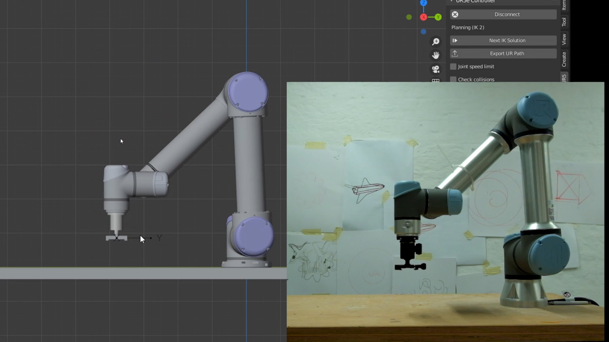
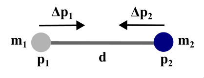
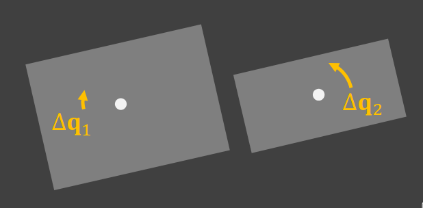
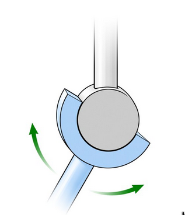
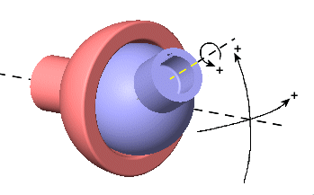
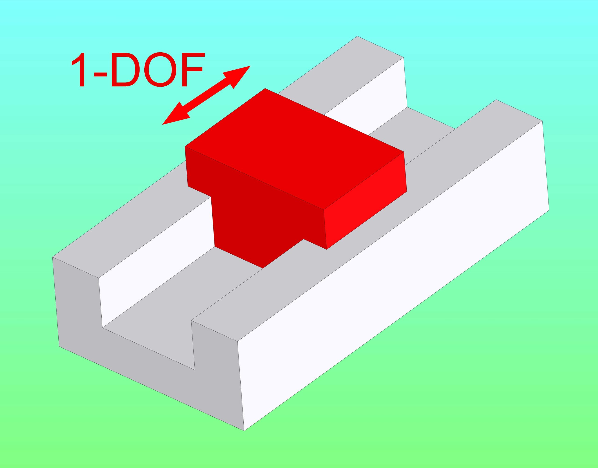
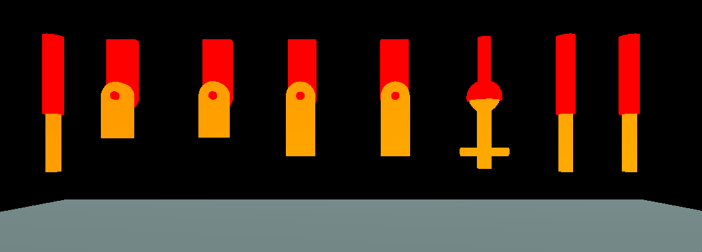

# Symulacja przegubów mechanicznych z ciałami sztywnymi i XPBD

Tutorial dotyczący symulacji przegubów przy użyciu Extended Position-Based Dynamics (XPBD). Tutorial oparty jest na [Joint Simulation by 10 Minute Physics](https://www.youtube.com/watch?v=YVaQxeWGlJA).

---

## Spis treści

1. [Wprowadzenie](#wprowadzenie)
2. [Podstawowe koncepcje symulacji przegubów](#podstawowe-koncepcje-symulacji-przegubów)
3. [Zrozumienie ograniczeń przegubów](#zrozumienie-ograniczeń-przegubów)
4. [Przeguby jako zbiory ograniczeń](#przeguby-jako-zbiory-ograniczeń)
5. [Typy przegubów i ich ograniczenia](#typy-przegubów-i-ich-ograniczenia)
6. [Szczegóły implementacji](#szczegóły-implementacji)
7. [Rozwiązywanie problemów](#rozwiązywanie-problemów)
8. [Podsumowanie](#podsumowanie)

---

## Wprowadzenie

### Dlaczego symulować przeguby?

Przeguby są fundamentalnymi komponentami w każdym systemie z ruchem mechanicznym: ludzie, roboty, pojazdy, maszyny i animowane postacie. Chociaż my, jako ludzie, również mamy przeguby, w tym tutorialu omówię najpopularniejsze przeguby mechaniczne, takie jak przeguby pryzmatyczne (prismatic joints), przeguby zawiasowe (hinge joints) i przeguby kulowe (ball joints). Symulacja zachowania tych przegubów jest bardzo przydatna na wiele sposobów. Na przykład, gdy wizualizujemy, jak zachowuje się zawieszenie samochodu przed zbudowaniem fizycznego prototypu, lub gdy budujemy gry z wiarygodnym zachowaniem mechanicznym.


*Będziemy symulować zachowanie pojedynczego przegubu (np. zawiasowego lub pryzmatycznego), a nie zintegrowany system pełnego ramienia robota. To wykracza poza zakres tego tutoriala.*

### Czego się nauczysz

Starałem się, aby ten tutorial był jak najbardziej samowystarczalny, co oznacza, że wszystkie potrzebne informacje do zbudowania przegubu będą w tym tutorialu; gdy jednak mi się to nie uda, dołączę linki i referencje, aby móc zagłębić się głębiej. Do budowy symulacji przegubów użyjemy konkretnie **Extended Position-Based Dynamics (XPBD)**[^2] z ciałami sztywnymi. O XPBD porozmawiamy później, nie martw się.

Pod koniec tego tutoriala zrozumiesz:

- Jak przeguby są konstruowane z ograniczeń geometrycznych[^3]
- Jak XPBD rozwiązuje ograniczenia przegubów z niezależnością od kroku czasowego
- Jak zaimplementować popularne typy przegubów: pryzmatyczne, kulowe (spherical), zawiasowe (revolute) i inne
- Jak działają ramki przegubów, korekty ograniczeń i ważenie masy
- Jak debugować i optymalizować symulacje przegubów

---

## Co powinieneś wiedzieć wcześniej

Chociaż tutorial jest stworzony tak, aby był dostępny, musisz znać pewne zasady, aby w pełni z niego skorzystać:

- **Podstawowa matematyka i fizyka**: Zrozumienie wektorów, kątów i podstawowej mechaniki (masa, siła, prędkość). Również wiedza, że obiekty mogą zarówno się poruszać (translacja) jak i obracać (rotacja).
- **Podstawowe programowanie**: Python

Oto kilka filmów, aby odświeżyć wiedzę:

1. [Newton's Second Law of Motion - Force, Mass, & Acceleration](https://www.youtube.com/watch?v=Ee6CHn0MRKE)

2. [Matrix Operations Cheat Sheet](https://pmt.physicsandmathstutor.com/download/Maths/A-level/Further/Core-Pure/Edexcel/CP1/Cheat-Sheets/Ch.6%20Matrices.pdf)

---

## Podstawowe koncepcje symulacji przegubów

### Position-Based Dynamics vs Force-based Dynamics

[Position Based Dynamics by Mathias Muller](https://www.youtube.com/watch?v=qISgdDhdCro&list=PLfd9K5jHLvZC1dE_O68lc3Jf0kUvidYFr)

Symulacja fizyczna wysokiej wierności oblicza siły i używa drugiej zasady dynamiki Newtona ($F = ma$), aby znaleźć przyspieszenia, *następnie całkuje*, aby uzyskać prędkości i pozycje. Jednak to **podejście oparte na siłach** ma problemy w symulacji przegubów:

- **Niestabilność i złożoność**: Sztywne przeguby wymagają bardzo sztywnych sił (powodujących niestabilność numeryczną), a dokładne ograniczenia wymagałyby nieskończonych sił, które są niemożliwe do zasymulowania.
- **Złożoność ograniczeń**: Obliczanie dokładnych sił potrzebnych do spełnienia ograniczeń przegubów jest matematycznie złożone.

**Position-Based Dynamics (PBD)**[^1] rozwiązuje te problemy, przyjmując inne podejście: zamiast obliczać siły, **bezpośrednio manipuluje pozycjami**, aby spełnić ograniczenia. Pomyśl o tym tak: jeśli ograniczenie przegubu mówi "te dwa punkty muszą być 1 metr od siebie", PBD po prostu przesuwa punkty, aby były dokładnie 1 metr od siebie, a następnie ustala, jakie powinny być prędkości. To podejście jest bezwarunkowo stabilne (nie wybuchnie nawet przy nieskończonej sztywności) i idealne dla twardych ograniczeń (może egzekwować dokładne reguły geometryczne).

### Czym jest XPBD i dlaczego go potrzebujemy?

[XPBD by Mathias Muller](https://www.youtube.com/watch?v=jrociOAYqxA)

**Extended Position-Based Dynamics (XPBD)**[^2] rozszerza PBD o **compliance ($\alpha$)**, aby osiągnąć niezależne od kroku czasowego, fizycznie dokładne rozwiązywanie ograniczeń—niezbędne dla symulacji przegubów[^3].

**Problem z regularnym PBD**: Chociaż PBD jest stabilne, ma krytyczną wadę: sztywność ograniczeń zależy od kroku czasowego i liczby iteracji solvera. Oznacza to:
- Jeśli zmienisz częstotliwość klatek (np. z 60 FPS na 120 FPS), przeguby będą wydawać się [sztywniejsze](https://www.youtube.com/watch?v=-3X6zDaJ8r4) lub bardziej miękkie

**Jaki jest związek między częstotliwością klatek a krokiem czasowym?** Częstotliwość klatek (mierzona w FPS lub Hz) i krok czasowy ($\Delta t$) są bezpośrednio powiązane: przy 60 FPS, $\Delta t = 1/60$ sekundy; przy 120 FPS, $\Delta t = 1/120$ sekundy (połowa rozmiaru). Gdy podwajasz częstotliwość klatek, zmniejszasz o połowę krok czasowy. W regularnym PBD, mniejsze kroki czasowe sprawiają, że ograniczenia są efektywnie sztywniejsze, więc ten sam przegub będzie zachowywać się inaczej przy różnych częstotliwościach klatek. Dodatkowo, zwiększenie iteracji solvera lub zmiana parametru sztywności ($k$, 0-1) również wpływa na zachowanie, a $k$ nie odpowiada rzeczywistym jednostkom fizycznym.

**Dlaczego to ma znaczenie dla przegubów?** W systemach mechanicznych musisz symulować rzeczywiste specyfikacje (np. "ten przegub ma sztywność 1000 N/m"), mieć spójne zachowanie na różnych urządzeniach lub częstotliwościach klatek, oraz mierzyć rzeczywiste siły/momenty działające na przeguby (ważne dla robotyki).

**Rozwiązanie XPBD**: XPBD używa **compliance ($\alpha$)**, które jest odwrotnością sztywności ($\alpha = 1/k$). Kluczową innowacją jest to, że XPBD zapewnia, że zachowanie materiału pozostaje **niezależne od kroku czasowego i liczby iteracji**. Oznacza to, że zachowanie przegubu pozostaje spójne na różnych częstotliwościach klatek, możesz używać rzeczywistych jednostek fizycznych (Newtony, metry, sekundy) i odzyskiwać rzeczywiste siły/momenty działające na przeguby.

**Kluczowa różnica**: XPBD używa compliance ($\alpha = 1/k$) zamiast parametru sztywności PBD ($k$). To zapewnia, że zachowanie przegubu pozostaje spójne niezależnie od częstotliwości klatek lub iteracji solvera.

### Ważenie masy w korektach przegubów

Gdy ograniczenie przegubu jest naruszone, korekty są stosowane do obu połączonych ciał. Korekta jest **dzielona zgodnie z odwrotnością masy**:

- **Odwrotność masy ($w = 1/m$)**: Cięższe obiekty mają mniejsze odwrotności masy i poruszają się mniej. Obiekty statyczne mają $w = 0$ (nieskończona masa).

**Dlaczego ważenie masy jest ważne?** To jest kluczowe dla realistycznego zachowania przegubów: W rzeczywistym świecie, gdy dwa obiekty są połączone, lżejszy obiekt porusza się bardziej niż cięższy (realizm fizyczny). Ważenie masy zapewnia zachowanie pędu i obiekty statyczne (nieskończona masa, $w = 0$) otrzymują zerową korektę i nie poruszają się.

**Dlaczego używać odwrotności masy zamiast zwykłej masy?** Używanie odwrotności masy ($w = 1/m$) ułatwia obsługę obiektów statycznych ($w = 0$ zamiast nieskończonej masy), poprawia stabilność numeryczną (mnożenie zamiast dzielenia) i upraszcza obliczenia (np. $w_1 + w_2$ zamiast $1/m_1 + 1/m_2$).

- **Efektywna odwrotność masy**: Ponieważ korekty przegubów są stosowane w punktach przyłączenia (nie w środkach masy), efektywna odwrotność masy uwzględnia zarówno masę liniową, jak i bezwładność rotacyjną w tym punkcie. To zapewnia realistyczne zachowanie, w którym ciężkie obiekty opierają się korekcie bardziej niż lekkie.

**Dlaczego punkt przyłączenia ma znaczenie?** Gdy pchasz ciało sztywne z dala od jego środka masy, ciało zarówno się przesuwa, jak i obraca. Opór zależy zarówno od masy (translacja), jak i momentu bezwładności (rotacja), więc musimy uwzględnić oba efekty, ponieważ przyłączenia przegubów zazwyczaj nie są w środku masy.

### Krok predykcji

W symulacji przegubów XPBD, **[Semi-Implicit Euler](https://en.wikipedia.org/wiki/Backward_Euler_method)** jest używany do początkowej predykcji:

$$v_{new} = v_{old} + g \cdot \Delta t$$

$$x_{new} = x_{old} + v_{new} \cdot \Delta t$$

**Czym jest Semi-Implicit Euler?** To prosta metoda całkowania numerycznego, która najpierw aktualizuje prędkość używając przyspieszenia (z grawitacji), a następnie aktualizuje pozycję używając **nowej** prędkości (nie starej). Część "semi-implicit" sprawia, że jest bardziej stabilna niż używanie starej prędkości.

**Dlaczego najpierw przewidywać?** Ten krok przewiduje, gdzie ciała poruszyłyby się **bez uwzględnienia ograniczeń przegubów**. Następnie, w kolejnym kroku, stosujemy korekty ograniczeń, aby "naprawić" pozycje, tak aby spełniały reguły przegubów. Ten dwuetapowy proces (przewidywanie, potem korekta) jest rdzeniem metod opartych na pozycji.

### Rozwiązywanie ograniczeń XPBD

XPBD rozwiązuje ograniczenia używając compliance ($\alpha$) w obliczeniu mnożnika Lagrange'a[^2]:

**XPBD**: $\lambda = -\frac{C}{w + \alpha / \Delta t^2}$

gdzie $C$ jest naruszeniem ograniczenia, $w$ jest efektywną odwrotnością masy (uwzględnia masę i bezwładność rotacyjną obu ciał), $\alpha$ jest compliance ($\alpha = 0$ dla twardych ograniczeń, $\alpha > 0$ dla miękkich), a $\lambda$ jest mnożnikiem Lagrange'a (reprezentuje "wysiłek" potrzebny do spełnienia ograniczenia).

**Czym jest mnożnik Lagrange'a?** W rozwiązywaniu ograniczeń, mnożnik Lagrange'a ($\lambda$) reprezentuje "wysiłek" (siłę lub moment) wymagany do spełnienia ograniczenia. Pomyśl o tym jako o odpowiedzi na pytanie: "Ile muszę pchnąć/pociągnąć, aby to ograniczenie było spełnione?" W XPBD możemy odzyskać rzeczywistą siłę fizyczną z $\lambda$ używając: $F = \frac{\lambda \cdot n}{\Delta t^2}$, gdzie $n$ jest kierunkiem korekty.

**Jak mierzone jest naruszenie ograniczenia?** Dla każdego typu ograniczenia mamy funkcję, która mierzy, jak daleko obecny stan jest od spełnienia ograniczenia. Na przykład, ograniczenie odległości: $C = |p_1 - p_0| - d_{rest}$ (obecna odległość minus pożądana odległość), lub zbieżność punktów: $C = |p_1 - p_0|$ (powinno być 0).

**Dlaczego człon compliance ($\alpha / \Delta t^2$)?** Ten człon sprawia, że ograniczenie jest "miękkie", gdy $\alpha > 0$. Dzielenie przez $\Delta t^2$ zapewnia, że miękkość pozostaje spójna niezależnie od rozmiaru kroku czasowego. Gdy $\alpha = 0$, ograniczenie jest idealnie sztywne (twarde ograniczenie).

To zapewnia, że zachowanie przegubu jest **niezależne od kroku czasowego** i pozwala na odzyskanie rzeczywistych sił/momentów działających na przeguby.

---

## Zrozumienie ograniczeń przegubów

### Czym jest ograniczenie?

**Ograniczenie** to po prostu reguła, która ogranicza, jak dwa połączone ciała mogą poruszać się względem siebie. Pomyśl o tym jak o regule w grze: "Te dwa punkty muszą zawsze być dokładnie 1 metr od siebie" lub "Te dwa ciała mogą obracać się tylko wokół tej jednej osi."

**Ograniczenia przegubów** występują w dwóch typach: **Ograniczenia pozycji** (reguły o tym, gdzie rzeczy muszą być, np. zbieżność punktów lub limity odległości) i **Ograniczenia orientacji** (reguły o tym, jak rzeczy mogą się obracać, np. wyrównanie osi lub limity kątów).

### Jak działają ograniczenia

Każde ograniczenie ma prostą pracę: **sprawdź, czy reguła jest przestrzegana, a jeśli nie, napraw to**.

**Krok 1: Zmierz naruszenie**
Ograniczenie mierzy, jak daleko obecna sytuacja jest od tego, czego wymaga reguła. Ten pomiar nazywa się **naruszeniem**.

**Przykład**: Wyobraź sobie ograniczenie odległości, które mówi "dwa punkty muszą być 1 metr od siebie": Jeśli są 1,2m od siebie → naruszenie $= 0.2m$ (za daleko); jeśli 0,8m od siebie → naruszenie $= -0.2m$ (za blisko); jeśli dokładnie 1,0m → naruszenie $= 0$ (spełnione).



**Krok 2: Zastosuj korektę**
Jeśli naruszenie nie jest zerem, solver przesuwa ciała, aby to naprawić. Im większe naruszenie, tym większa potrzebna korekta.

**W terminach matematycznych**: Ograniczenia są zapisane jako $C(q) = 0$, gdzie $q$ reprezentuje obecny stan ciał (pozycje i rotacje), $C(q)$ mierzy naruszenie, a $C(q) = 0$ oznacza, że ograniczenie jest spełnione.

Dla przegubu łączącego dwa ciała, $q$ obejmuje, gdzie każde ciało jest zlokalizowane i jak każde ciało jest obrócone. Funkcja ograniczenia $C$ sprawdza, czy reguła jest przestrzegana i oblicza, jak daleko jesteśmy.

---

## Przeguby jako zbiory ograniczeń

### Fundamentalny wgląd

**Przegub mechaniczny jest zbiorem ograniczeń**, które ograniczają względny ruch między dwoma ciałami sztywnymi[^3].

Każdy typ przegubu egzekwuje określony zestaw reguł geometrycznych i kinematycznych poprzez stosowanie ograniczeń pozycji i orientacji.

### Ramki przegubów i konfiguracja spoczynkowa

W profesjonalnych silnikach fizycznych, przeguby to nie tylko "punkty", ale **ramki współrzędnych** składające się z pozycji (pozycja i rotacja)[^3].

**Dlaczego ramki współrzędnych zamiast tylko punktów?** Przegub musi kontrolować zarówno, gdzie ciała się przyłączają (pozycja), jak i jak są zorientowane względem siebie (rotacja).

Pojedynczy punkt daje nam tylko pozycję. Ramka współrzędnych (z pozycją + trzema prostopadłymi osiami) daje nam zarówno pozycję, jak i orientację, których potrzebujemy dla przegubów takich jak zawiasy (które mają określoną oś rotacji) lub przeguby pryzmatyczne (które mają określony kierunek przesuwania).



**Ramki przegubów ($L_0$ i $L_1$)**: Każdy przegub kojarzy lokalną pozycję z każdym z dwóch ciał sztywnych, które łączy ($body_0$ i $body_1$). Te lokalne ramki są określone względem środka masy każdego ciała, pozostają stałe przez całą symulację i są transformowane do przestrzeni świata w każdym kroku używając obecnej globalnej pozycji ($X$) i rotacji ($Q$) ciała.

**Dlaczego lokalne ramki?** Używanie lokalnych ramek (względem każdego ciała) zamiast ramek w przestrzeni świata sprawia, że przeguby są odporne na ruch ciała. Przegub "pamięta", gdzie jest przyłączony na każdym ciele, a gdy ciała poruszają się i obracają, ramki przegubów poruszają się z nimi.

**Konfiguracja spoczynkowa**: Podczas konfigurowania przegubu definiujesz punkt przyłączenia ($P_{rest}$) i zestaw prostopadłych osi ($A_{rest}$ i $B_{rest}$) dla obu ciał, gdy są w stanie "spoczynkowym" lub neutralnym.

**Dlaczego definiować konfigurację spoczynkową?** Konfiguracja spoczynkowa definiuje "neutralny" stan przegubu—jak ciała są zorientowane względem siebie, gdy przegub jest w swojej domyślnej pozycji. To definiuje, co oznacza "kąt zero" dla przegubów rotacyjnych, ustala ramkę odniesienia do pomiaru kątów i odległości oraz zapewnia, że przegub zaczyna w prawidłowym stanie.

**Równanie przegubu**: Celem solvera jest zapewnienie[^3]:

$$G_0 \cdot L_0 \cdot J = G_1 \cdot L_1$$

gdzie $G$ reprezentuje globalną pozycję ciał (gdzie są w przestrzeni świata), $L$ reprezentuje lokalne ramki przegubów (gdzie przegub przyłącza się na każdym ciele), a $J$ jest pozycją przegubu zdefiniowaną przez reguły przegubu (np. pozwalającą na rotację wokół jednej osi dla zawiasu).

**Co oznacza to równanie?** To równanie mówi: "Przekształć lokalną ramkę przegubu $body_0$ do przestrzeni świata, zastosuj dozwolony ruch przegubu ($J$), a wynik powinien równać się lokalnej ramce przegubu $body_1$ przekształconej do przestrzeni świata." Prościej: przegub zapewnia, że dwie ramki przyłączenia utrzymują relację zdefiniowaną przez $J$.

### Stopnie swobody (DOF)

**Stopnie swobody (DOF)** to liczba niezależnych sposobów, w jakie ciało może się poruszać.

Wolne ciało sztywne ma **6 DOF** (3 translacja + 3 rotacja). Każde ograniczenie usuwa jeden lub więcej DOF, a ograniczenia przegubu określają, ile DOF pozostaje.

<!-- IMAGE: Search for "degrees of freedom rigid body 6 DOF" or "translation rotation 3D" -->
<!-- Alternative: Diagram showing a cube with 3 translation arrows (x, y, z) and 3 rotation arrows (roll, pitch, yaw) -->

**Dlaczego dbamy o DOF?** Zrozumienie DOF pomaga projektować przeguby (wiedzieć, ile ograniczeń potrzebujesz: $6 - DOF_{desired}$), debugować (sprawdzić, czy masz właściwą liczbę ograniczeń) i zrozumieć zachowanie (np. zawias ma 1 DOF, przegub kulowy ma 3 DOF).

### Pętla solvera

Nowoczesne symulacje XPBD następują po trójfazowej pętli:

<!-- IMAGE: Search for "XPBD solver loop flowchart" or "position based dynamics algorithm flowchart" -->
<!-- Alternative: Flowchart showing: Prediction → Solve → Update, with arrows and brief descriptions -->

#### Faza 1: Predykcja
Przewiduj następny stan używając sił zewnętrznych (takich jak grawitacja) **bez uwzględniania przegubów jeszcze**:

$$v = v + \Delta t \cdot \frac{F_{ext}}{m}$$

$$x_{new} = x + \Delta t \cdot v$$

**Dlaczego przewidywać bez przegubów?** Najpierw pozwalamy ciałom poruszać się "swobodnie" pod wpływem sił zewnętrznych (takich jak grawitacja). Następnie korygujemy ich pozycje, aby spełnić ograniczenia przegubów. To oddzielenie sprawia, że algorytm jest prostszy i bardziej stabilny.

#### Faza 2: Rozwiązywanie
Iteracyjnie manipuluj pozycjami i orientacjami, aby spełnić wszystkie ograniczenia przegubów. To używa podejścia **Non-linear Gauss-Seidel**[^1]: każdy przegub jest rozwiązywany jeden po drugim z natychmiastowo aktualizowanymi pozycjami, a wiele iteracji może być potrzebnych dla zbieżności.

**Czym jest Gauss-Seidel?** Gauss-Seidel to metoda iteracyjna, w której rozwiązujesz ograniczenia jedno po drugim, natychmiast aktualizując stan po każdym ograniczeniu. To jest w przeciwieństwie do metod, które rozwiązują wszystkie ograniczenia jednocześnie. Zaletą jest prostota i efektywność—możesz rozwiązać każde ograniczenie niezależnie.

**Co oznacza "zbieżność"?** Zbieżność oznacza, że solver znalazł rozwiązanie, w którym wszystkie ograniczenia są spełnione (lub bardzo blisko spełnione). Czasami jedna iteracja nie wystarczy, szczególnie gdy ograniczenia oddziałują ze sobą. Solver kontynuuje iterowanie, aż ograniczenia są spełnione lub osiągnięta zostanie maksymalna liczba iteracji.

#### Faza 3: Aktualizacja
Wyprowadź "prawdziwą" końcową prędkość na podstawie przemieszczenia spowodowanego przez solver:

$$v = \frac{x_{final} - x_{initial}}{\Delta t}$$

**Dlaczego aktualizować prędkości?** Po skorygowaniu pozycji, aby spełnić ograniczenia, prędkości muszą być zaktualizowane, aby pasowały do rzeczywistego ruchu. To zapewnia, że prędkości są spójne z pozycjami, co jest ważne dla następnego kroku czasowego.

**Pro Tip: Substepping**: Dzielenie kroku czasowego na mniejsze podkroki jest znacznie bardziej efektywne niż wiele iteracji solvera[^2]. Najlepszym wyborem jest często maksymalna liczba podkroków z tylko jedną iteracją solvera na podkrok.

**Dlaczego substepping jest lepszy?** Substepping oznacza dzielenie kroku czasowego (np. $1/60$ sekundy) na mniejsze części (np. 10 podkroków po $1/600$ sekundy każdy). To jest bardziej efektywne, ponieważ mniejsze kroki czasowe zapewniają dokładniejsze całkowanie, ograniczenia są rozwiązywane częściej (redukując dryf), a jedna iteracja na podkrok jest często lepsza niż wiele iteracji na dużym kroku czasowym.

### Porządkowanie ograniczeń

Kolejność, w jakiej przeguby są rozwiązywane, może wpływać na zachowanie (Gauss-Seidel jest zależny od kolejności)[^3]: rozwiązuj przeguby "rodzicielskie" przed "dziecięcymi" w łańcuchu dla szybszej zbieżności i utrzymuj kolejność stałą, aby zapobiec oscylacjom. Jeśli potrzebna jest niezależność od kolejności, użyj iteracji typu Jacobi (wolniejsza zbieżność).

**Co oznacza "zależny od kolejności"?** Z Gauss-Seidel kolejność ma znaczenie, ponieważ każde ograniczenie jest rozwiązywane używając obecnego (już zaktualizowanego) stanu. Jeśli rozwiązujesz ograniczenie A, potem B, B widzi efekty A. Jeśli rozwiązujesz B, potem A, A widzi efekty B. To może prowadzić do różnych wyników.

**Dlaczego rozwiązywać rodziców przed dziećmi?** W łańcuchu przegubów (jak ramię robota), rozwiązywanie przegubów rodzicielskich najpierw zapewnia, że gdy rozwiązujesz przeguby dziecięce, rodzic jest już w prawidłowej pozycji. To często prowadzi do szybszej zbieżności.

**Czym jest iteracja Jacobi?** Iteracja Jacobi rozwiązuje wszystkie ograniczenia jednocześnie używając starego stanu (przed jakimikolwiek aktualizacjami). To sprawia, że jest niezależna od kolejności, ale wolniej zbiega, ponieważ nie korzysta z interakcji ograniczeń.

### Warm Starting

**Warm starting** ponownie używa mnożnika Lagrange'a ($\lambda$) z poprzedniej klatki, aby przyspieszyć zbieżność[^2]. Ponieważ $\lambda$ reprezentuje wewnętrzną siłę/wysiłek wymagany do spełnienia przegubu i jest zazwyczaj podobny z klatki na klatkę, inicjalizacja z poprzednimi wartościami $\lambda$ zaczyna bliżej prawidłowej odpowiedzi. To jest szczególnie przydatne dla trwałych kontaktów i złożonych przegubów.

**Dlaczego warm starting pomaga?** W większości klatek, przeguby nie zmieniają się dramatycznie. "Wysiłek" ($\lambda$) potrzebny do spełnienia ograniczenia jest zazwyczaj podobny z klatki na klatkę. Zaczynając z wartością $\lambda$ z poprzedniej klatki, solver zaczyna bliżej rozwiązania i zbiega szybciej.

---

## Typy przegubów i ich ograniczenia

Ta sekcja szczegółowo opisuje popularne typy przegubów mechanicznych, ich ograniczenia i zastosowania.

### Tabela przeglądowa

| Typ przegubu | Ograniczenia pozycji | Ograniczenia orientacji | Zastosowania |
|------------|---------------------|------------------------|--------------|
| **Distance** | Odległość = rest_length | Brak (swobodna rotacja) | Liny, łańcuchy, wahadła |
| **Hinge (Revolute)** | Zbieżność punktów | Wyrównanie osi; opcjonalny kąt docelowy/limity | Drzwi, koła, stawy robota |
| **Ball (Spherical)** | Zbieżność punktów | Opcjonalne limity swing/twist | Przegub kulowy, ramiona, zaczepy przyczep |
| **Prismatic** | Przesuwanie wzdłuż osi $[min, max]$ | Wyrównanie osi; opcjonalne limity twist | Szuflady, cylindry hydrauliczne |
| **Cylinder** | Przesuwanie wzdłuż osi $[min, max]$ | Wyrównanie osi; swobodny twist | Systemy tłok-cylinder |

### 1. Przegub Distance

**Co robi**: Utrzymuje odległość między dwoma punktami przyłączenia na **odległości spoczynkowej**. Może być sztywne (jak pręt) lub miękkie (jak sprężyna) w zależności od compliance.

### 2. Przegub Hinge (Revolute)

**Co robi**: Pozwala na rotację **tylko wokół jednej osi** (jak zawias drzwi). Dwa ciała dzielą wspólną oś rotacji, ale mogą obracać się niezależnie wokół niej.



**Ograniczenia**: **Pozycja** - 1 ograniczenie (zbieżność punktów, odległość $= 0$). **Orientacja** - Wyrównanie osi (osie zawiasu muszą być wyrównane), opcjonalny kąt docelowy, opcjonalne limity swing $[swing_{min}, swing_{max}]$.

**Parametry**: `swingMin`, `swingMax` (limity swing), `targetAngle` (opcjonalny), `targetAngleCompliance`, `damping` (tłumienie kątowe).

**Przypadki użycia**: Drzwi, koła, stawy robota

### 3. Przegub Ball (Spherical)

**Co robi**: Utrzymuje dwa **punkty przyłączenia zbieżne**, ale pozwala na **pełną rotację 3D** (przegub kulowy). Opcjonalnie ogranicza zakres ruchu.



**Ograniczenia**: **Pozycja** - 1 ograniczenie (zbieżność punktów, odległość $= 0$). **Orientacja** - Opcjonalny limit swing (stożek dozwolonych kierunków, obliczony z kąta między osiami X) i limit twist $[twist_{min}, twist_{max}]$ (obliczony z osi wtórnych rzutowanych na płaszczyznę).

**Parametry**: `swingMax` ($swing_{min}$ zazwyczaj $= 0$), `twistMin`, `twistMax`, `damping` (kątowe).

**Przypadki użycia**: Przegub kulowy, ramiona, zaczepy przyczep

### 4. Przegub Prismatic

**Co robi**: Pozwala na **translację tylko wzdłuż jednej osi** (ruch przesuwowy). Rotacja wokół tej osi (twist) może być swobodna lub ograniczona; brak swing (osie pozostają wyrównane).



**Ograniczenia**: **Pozycja** - 1 ograniczenie (odległość wzdłuż osi X ograniczona do $[distance_{min}, distance_{max}]$, solver rzutuje separację na oś i stosuje korektę). **Orientacja** - Swing: osie X wyrównane; Twist: opcjonalne limity $[twist_{min}, twist_{max}]$.

**Parametry**: `distanceMin`, `distanceMax`, `distanceTarget` (opcjonalny), `twistMin`, `twistMax` (opcjonalne), `damping` (liniowe wzdłuż osi przesuwu).

---

## Szczegóły implementacji



Ta sekcja opisuje zaimplementowaną symulację fizyczną 3D ciał sztywnych zbudowaną w Pythonie, Pygame i OpenGL, która implementuje rozwiązywanie ograniczeń w stylu XPBD dla przegubów.

### Struktura projektu

Projekt jest zorganizowany w kilka modułów:

- **`rigid_body.py`**: Implementuje klasę `RigidBody` z pozycją, orientacją, prędkością, prędkością kątową, masą i bezwładnością. Obsługuje całkowanie (Semi-implicit Euler) i korektę ograniczeń poprzez metodę `apply_correction`.
- **`joint.py`**: Implementuje klasę `Joint`, która łączy dwa ciała. Każdy typ przegubu ma metody `solve_position` i `solve_orientation`, które egzekwują ograniczenia. Obsługuje przeguby Distance, Hinge, Ball, Prismatic i Cylinder.
- **`simulator.py`**: Zawiera klasę `RigidBodySimulator`, która uruchamia główną pętlę symulacji z substeppingiem, obsługuje przeguby do przeciągania dla interakcji myszy i zarządza wszystkimi ciałami i przegubami.
- **`scene_importer.py`**: Ładuje sceny z plików JSON, tworząc ciała sztywne i przeguby z definicji scen.
- **`app.py`**: Klasa `JointSimulationApp` obsługuje inicjalizację Pygame/OpenGL, kontrolę kamery, raycasting myszy do wyboru i wyświetlanie nakładki debugowania.

### Pętla symulacji

Główna pętla symulacji w `simulator.py` działa w każdej klatce:

```python
def simulate(self):
    sdt = self.dt / self.num_sub_steps  # Czas podkroku (zazwyczaj 10 podkroków)
    
    for sub_step in range(self.num_sub_steps):
        # 1. Całkuj wszystkie ciała (krok predykcji)
        for body in self.rigid_bodies:
            body.integrate(sdt, self.gravity)
        
        # 2. Rozwiąż wszystkie ograniczenia przegubów
        for joint in self.joints:
            joint.solve(sdt)  # Wywołuje solve_position, potem solve_orientation
        
        # 3. Aktualizuj prędkości ze skorygowanych pozycji
        for body in self.rigid_bodies:
            body.update_velocities()
        
        # 4. Zastosuj tłumienie na przegub
        for joint in self.joints:
            joint.apply_linear_damping(sdt)
            joint.apply_angular_damping(sdt)
```

Każdy podkrok: całkuje ciała (grawitacja → prędkość → pozycja), rozwiązuje wszystkie ograniczenia przegubów (pozycja, potem orientacja), aktualizuje prędkości ze zmian pozycji i stosuje tłumienie, aby zmniejszyć oscylacje.

### Implementacja korekty ograniczeń

Główne rozwiązywanie ograniczeń jest w metodzie `RigidBody.apply_correction` w `rigid_body.py`:

```python
def apply_correction(self, compliance, corr, pos, other_body=None, other_pos=None, velocity_level=False):
    C = corr.length()  # Naruszenie ograniczenia
    normal = corr.normalized()
    
    # Efektywna odwrotność masy (uwzględnia bezwładność rotacyjną w punkcie)
    w = self.get_inverse_mass(normal, pos)
    if other_body:
        w += other_body.get_inverse_mass(normal, other_pos)
    
    # XPBD: Dodaj człon compliance
    if not velocity_level:
        alpha = compliance / self.dt / self.dt
        lambda_val = -C / (w + alpha)
    else:
        lambda_val = -C / w  # Dla tłumienia (poziom prędkości)
    
    # Zastosuj korekty do obu ciał (ważone przez odwrotność masy)
    correction = normal * (-lambda_val)
    self._apply_correction(correction, pos, velocity_level)
    if other_body:
        correction_other = normal * lambda_val
        other_body._apply_correction(correction_other, other_pos, velocity_level)
```

Metoda `get_inverse_mass` oblicza efektywną odwrotność masy w punkcie: $w_{effective} = \frac{1}{m} + (r \times n)^T \cdot I^{-1} \cdot (r \times n)$, uwzględniając zarówno masę liniową, jak i bezwładność rotacyjną.

### Implementacja przegubów

Każdy typ przegubu w `joint.py` implementuje metody `solve_position` i `solve_orientation`:

**Przegub Distance**: W `solve_position` oblicza odległość między punktami przyłączenia, oblicza naruszenie $C = |p_1 - p_0| - d_{rest}$ i stosuje korektę wzdłuż linii łączącej. Brak ograniczeń orientacji.

**Przegub Hinge**: `solve_position` egzekwuje zbieżność punktów (odległość $= 0$). `solve_orientation` wyrównuje osie zawiasu (osie X ramek przegubów) używając iloczynu wektorowego i opcjonalnie egzekwuje kąt docelowy lub limity swing poprzez metodę `limit_angle`.

**Przegub Ball**: `solve_position` egzekwuje zbieżność punktów. `solve_orientation` opcjonalnie ogranicza swing (kąt stożkowy między osiami X) i twist (rotację wokół osi między ciałami) używając `limit_angle`.

**Przegub Prismatic**: `solve_position` rzutuje separację na oś X przegubu i ogranicza do $[distance_{min}, distance_{max}]$. `solve_orientation` utrzymuje osie X wyrównane (swing) i opcjonalnie ogranicza twist.

**Przegub Cylinder**: Podobne do pryzmatycznego dla pozycji, ale pozwala na swobodny twist (brak limitów twist).

### Ograniczanie kąta

Metoda `limit_angle` w `joint.py` jest używana przez przeguby hinge, ball i prismatic do ograniczania zakresów rotacji:

```python
def limit_angle(self, n, a, b, min_angle, max_angle, compliance):
    phi = self.get_angle(n, a, b)  # Obecny kąt w płaszczyźnie z normalną n
    if min_angle <= phi <= max_angle:
        return  # W granicach
    
    phi_clamped = max(min_angle, min(phi, max_angle))
    angle_error = phi - phi_clamped
    
    # Korekta z iloczynu wektorowego, przeskalowana przez ograniczony błąd
    corr = a.cross(b)
    corr *= clamp(angle_error, -max_correction, max_correction)
    
    # Zastosuj z compliance
    self.body0.apply_correction(compliance, corr, None, self.body1, None)
    
    # Zastosuj tłumienie na poziomie prędkości, jeśli przekroczono limit (redukuje drgania)
    if abs(angle_error) > threshold:
        self.apply_angular_damping()
```

### Ładowanie sceny

Projekt ładuje sceny z plików JSON poprzez `scene_importer.py`. Każda siatka w JSON może być:
- **RigidBox** lub **RigidSphere**: Tworzy ciało sztywne z masą i bezwładnością obliczoną z gęstości i geometrii
- **Typy przegubów**: Tworzy przeguby łączące dwa ciała, z parametrami specyficznymi dla typu (restDistance, compliance, swingMin/Max, itp.)
- **Visual**: Dołącza siatki wizualne do ciał sztywnych do renderowania

Importer sceny parsuje JSON, tworzy ciała sztywne z wierzchołków (obliczając bounding boxy/kule), tworzy przeguby z określonymi parametrami i dołącza siatki wizualne do ciał.

### Interakcja i debugowanie

Moduł `app.py` zapewnia:
- **Mouse picking**: Raycasting do wyboru ciał, tworząc przegub przeciągania, który łączy ciało z kursorem myszy
- **Debug overlay**: Wyświetla FPS, pozycję kamery, współrzędne myszy, liczbę ciał/przegubów i inne informacje czasu wykonania
- **Kontrolki**: Spacja do pauzy/wznowienia, R do przeładowania sceny, przeciąganie lewym przyciskiem do przesuwania ciał

---

## Rozwiązywanie problemów

### Częste problemy i rozwiązania

#### 1. Wizualne drgania

**Objawy**: Obiekty wibrują lub trzęsą się szybko, nawet w spoczynku.

**Przyczyny**: Zmniejszone tłumienie numeryczne z substeppingu, niskie progi prędkości powodujące małe odbicia lub compliance zbyt niskie (system zbyt sztywny dla solvera).

**Rozwiązania**: Dodaj fizyczne współczynniki tłumienia do przegubów, użyj progowania prędkości (ustaw restytucję na zero, jeśli normalna prędkość jest poniżej progu, np. $|v| \leq 2\sqrt{|g|h}$), lub dostosuj compliance, aby uniknąć numerycznej sztywności poza możliwościami solvera.

#### 2. "Eksplozje" przegubów i niestabilność

**Objawy**: Połączone ciała rozlatują się z ekstremalnymi prędkościami, znikając ze sceny.

**Przyczyny**: Wysoka sztywność w solverach opartych na siłach (nie problem z PBD/XPBD), błędne wyrównanie ramek (początkowe ramki przegubów nie spełniają równania przegubu), niemożliwe parametry (np. minimalna odległość > maksymalna odległość) lub niestabilność kierunkowa w złożonych stosach.

**Rozwiązania**: Użyj PBD/XPBD (bezwarunkowo stabilne), zweryfikuj, że ramki przegubów są poprawnie transformowane do przestrzeni świata, sprawdź, że limity przegubów są fizycznie możliwe i użyj substeppingu (bardziej efektywne niż wiele iteracji).

#### 3. Dryf ograniczeń

**Objawy**: Przeguby powoli "rozciągają się" lub oddzielają w czasie, chociaż powinny być sztywne.

**Przyczyny**: Niewystarczające iteracje solvera, duże kroki czasowe lub błędy numeryczne kumulujące się.

**Rozwiązania**: Zwiększ podkroki (podziel krok czasowy na mniejsze części), zweryfikuj compliance (dla twardych ograniczeń, upewnij się, że $\alpha = 0$) lub sprawdź kolejność ograniczeń (niektóre kolejności zbiegają się lepiej).

#### 4. Narzędzia debugowania

**Wizualizuj błędy ograniczeń**: Rysuj linie reprezentujące naruszenia ograniczeń[^3]. Dla przegubu distance: $error = d_{rest} - d_{current}$. Znaczne wydłużenie wskazuje na compliance zbyt wysokie lub potrzebę więcej podkroków.

**Odzyskiwanie siły i momentu**: W XPBD, odzyskaj rzeczywiste siły[^2]: $F = \frac{\lambda \cdot n}{\Delta t^2}$. Porównaj z rozwiązaniami analitycznymi (np. waga obiektów), aby zweryfikować dokładność fizyczną.

**Monitoruj energię**: Śledź całkowitą energię (kinetyczną + potencjalną). Jeśli wahadło zyskuje wysokość lub zatrzymuje się nagle, sprawdź zachowanie energii.

---

## Podsumowanie

### Kluczowe wnioski

1. **Przeguby to ograniczenia**: Każdy przegub mechaniczny jest zbiorem ograniczeń geometrycznych i kinematycznych, które ograniczają względny ruch między ciałami.

2. **XPBD to nowoczesny standard**: Extended Position-Based Dynamics zapewnia niezależną od kroku czasowego, fizycznie dokładną symulację przegubów, zachowując bezwarunkową stabilność.

3. **Substepping jest kluczowy**: Dzielenie kroków czasowych na podkroki jest bardziej efektywne niż wiele iteracji solvera dla osiągnięcia wyników wysokiej wierności.

4. **Ograniczenia egzekwują reguły**: Ograniczenia pozycji (zbieżność punktów, limity odległości) i ograniczenia orientacji (wyrównanie osi, limity kątów) współpracują, aby stworzyć realistyczne zachowanie przegubów.

5. **Ważenie masy zapewnia realizm**: Korekty są dystrybuowane proporcjonalnie do odwrotności masy, zapewniając zachowanie pędu i realistyczne zachowanie.

### Dalsza lektura

Ten tutorial pokrył podstawy symulacji przegubów z XPBD. Dla głębszego zrozumienia, zbadaj:

- Szczegóły implementacji w `DOCUMENTATION.md`
- Prace naukowe o Position-Based Dynamics i XPBD (zobacz Referencje poniżej)
- Zaawansowane tematy: warm starting, porządkowanie ograniczeń, dynamika wielu ciał
- Zastosowania: robotyka, fizyka gier, rzeczywistość wirtualna

---

## Słownik

**Compliance ($\alpha$)**: Odwrotność sztywności ($\alpha = 1/k$). W XPBD sprawia, że ograniczenia są miękkie. $\alpha = 0$ oznacza nieskończenie sztywne (twarde ograniczenie). Wyższe $\alpha$ = bardziej miękkie ograniczenie.

**Constraint**: Matematyczne ograniczenie na to, jak ciała mogą się poruszać, wyrażone jako $C(q) = 0$. Ograniczenia przegubów egzekwują reguły pozycji i orientacji między połączonymi ciałami.

**Degrees of Freedom (DOF)**: Liczba niezależnych sposobów, w jakie ciało może się poruszać. Wolne ciało sztywne = 6 DOF (3 translacja + 3 rotacja). Ograniczenia przegubów usuwają DOF, aby ograniczyć ruch.

**Inverse Mass ($w$)**: $1/m$. Używane w korektach ograniczeń dla stabilności. Cięższe obiekty mają mniejsze $w$ i poruszają się mniej. Obiekty statyczne mają $w = 0$.

**Joint Frame ($L$)**: Lokalna ramka współrzędnych dołączona do każdego ciała w punkcie przegubu. Definiuje pozycję przyłączenia przegubu względem środka masy każdego ciała.

**Lagrange Multiplier ($\lambda$)**: Reprezentuje "wysiłek" (siłę/moment) potrzebny do spełnienia ograniczenia. W XPBD może być używany do odzyskania rzeczywistych sił fizycznych: $F = \frac{\lambda \cdot n}{\Delta t^2}$.

**Moment of Inertia ($I$)**: Opór rotacyjny. Zależny od kierunku, reprezentowany jako macierz $3 \times 3$ (tensor bezwładności) lub wektor 3D dla ciał wyrównanych z osiami głównymi.

**Substepping**: Dzielenie kroku czasowego na mniejsze podkroki dla poprawy dokładności i stabilności. Bardziej efektywne niż wiele iteracji solvera.

**XPBD (Extended Position-Based Dynamics)**: Rozwiązywanie ograniczeń oparte na pozycji używające compliance ($\alpha$) dla niezależnej od kroku czasowego, fizycznie dokładnej symulacji przegubów.

**$\Delta t$ (Delta Time)**: Czas trwania jednego kroku czasowego symulacji.

---

## Referencje

[^1]: [Position Based Dynamics: Matthias Müller, Bruno Heidelberger, Marcus Hennix, John Ratcliff](https://matthias-research.github.io/pages/publications/posBasedDyn.pdf)

[^2]: [Detailed Rigid Body Simulation
with Extended Position Based Dynamics: Matthias Müller, Miles Macklin, Nuttapong Chentanez, Stefan Jeschke, Tae-Yong Kim](https://matthias-research.github.io/pages/publications/PBDBodies.pdf).


[^3]: [Joint Simulation: Mathias Muller](https://matthias-research.github.io/pages/tenMinutePhysics/25-joints.pdf)

---

*Koniec Tutoriala*
